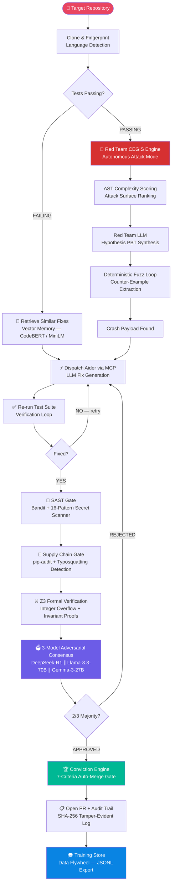
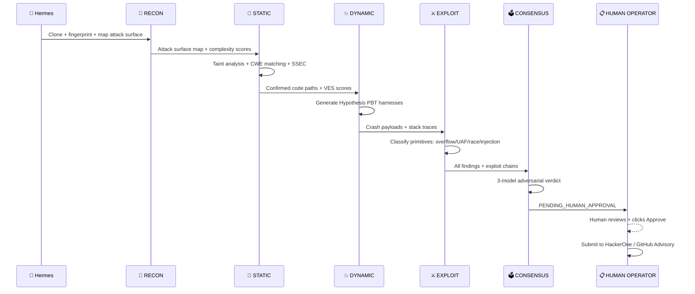

<div align="center">


<br/>

[](https://python.org)
[](https://gradio.app)
[](https://openrouter.ai)
[](https://huggingface.co/spaces/Architect8999/rhodawk-ai-devops-engine)
[](https://docker.com)
[](.)

<br/>

[](.)
[](.)
[](.)
[](.)

<br/>
<br/>

> **"The next generation of security tooling does not find known CVEs.**
> **It finds the assumptions that developers got wrong — before attackers do."**

<br/>

</div>

<hr/>

<div align="center">

## 🚀 Mythos-Level Upgrade

A complete blueprint for elevating Rhodawk to **Claude Mythos-class
autonomous vulnerability research** lives under [`mythos/`](mythos/) — see
[`mythos/MYTHOS_PLAN.md`](mythos/MYTHOS_PLAN.md) for the full living plan
(multi-agent framework, probabilistic reasoning, advanced static / dynamic /
exploit tooling, RL self-improvement, new MCP servers, FastAPI
productization). Enable with `RHODAWK_MYTHOS=1` or hit the new productization
API at `POST /v1/analyze_target` (run `uvicorn mythos.api.fastapi_server:app`).

| Layer | Module |
|---|---|
| Multi-agent (Planner / Explorer / Executor) | `mythos/agents/` |
| Probabilistic hypothesis engine + attack graphs | `mythos/reasoning/` |
| Static (Tree-sitter, Joern, CodeQL, Semgrep) | `mythos/static/` |
| Dynamic (AFL++, KLEE, QEMU, Frida, GDB) | `mythos/dynamic/` |
| Exploit (Pwntools, ROPGadget, heap, privesc) | `mythos/exploit/` |
| Self-improvement (RL, MLflow, LoRA, curriculum, episodic) | `mythos/learning/` |
| New MCP servers (5×) | `mythos/mcp/` (registered in `mcp_config.json`) |
| Productization API | `mythos/api/` |

---

## What Rhodawk Actually Is

</div>

Rhodawk is a **fully autonomous code repair and vulnerability research system**. Point it at any GitHub repository. It clones the code, runs the tests, generates fixes using state-of-the-art LLMs, passes every fix through a 7-layer security pipeline, and opens a verified pull request — with no human involvement in the loop unless you require it.

When tests are already passing, it switches into attack mode: it autonomously generates property-based fuzz tests, discovers invariant violations, and hands the crash payloads back to itself for patching. It is a self-healing system that simultaneously acts as its own red team.

<hr/>

<div align="center">

## The Full Autonomous Loop

</div>



<hr/>

<div align="center">

## Architecture at a Glance

```mermaid
graph LR
    subgraph UI["🖥️  Gradio Control Plane  (port 7860)"]
        APP[app.py\n2,311 lines]
    end

    subgraph ORCH["🧠  Intelligence Layer"]
        HO[hermes_orchestrator.py\nAutonomous Security Research]
        VL[verification_loop.py\nRetry-with-Context]
        CE[conviction_engine.py\nAuto-Merge Gate]
        AR[adversarial_reviewer.py\n3-Model Consensus]
    end

    subgraph ANALYSIS["🔬  Analysis Engines"]
        LR2[language_runtime.py\n7 Languages]
        RTF[red_team_fuzzer.py\nCEGIS Engine]
        FV[formal_verifier.py\nZ3 SMT Solver]
        SYM[symbolic_engine.py\nAngr Symbolic Exec]
        TA[taint_analyzer.py\nDataflow Analysis]
        CI[cve_intel.py\nNVD + SSEC Algorithm]
    end

    subgraph SECURITY["🛡️  Security Gates"]
        SG[sast_gate.py\nBandit + Secrets]
        SC[supply_chain.py\npip-audit + Typosquat]
        VC[vuln_classifier.py\nCWE → CVSS]
    end

    subgraph MEMORY["💾  Memory & Learning"]
        EM[embedding_memory.py\nSQLite / Qdrant]
        TS[training_store.py\nData Flywheel]
        LS[lora_scheduler.py\nFine-tune Export]
    end

    subgraph OUTPUT["📤  Output Layer"]
        BG[bounty_gateway.py\nHackerOne / Bugcrowd]
        WH[webhook_server.py\nPort 7861]
        AL[audit_logger.py\nSHA-256 Chain]
    end

    APP --> ORCH
    APP --> ANALYSIS
    APP --> SECURITY
    ORCH --> MEMORY
    ANALYSIS --> SECURITY
    SECURITY --> OUTPUT
    MEMORY --> TS --> LS
```

</div>



<hr/>

<div align="center">

## Five Custom Algorithms — Built From Scratch

</div>

<table>
<tr>
<td width="20%" align="center"><b>VES</b><br/><sub>Vulnerability Entropy Score</sub></td>
<td>Quantifies how <em>surprising</em> a code path is. Combines cyclomatic complexity (via Radon), dataflow depth, and deviation from the repository's own baseline. High-VES paths are statistically anomalous execution routes that warrant deeper analysis — the mathematical definition of "this shouldn't work this way."</td>
</tr>
<tr>
<td width="20%" align="center"><b>TVG</b><br/><sub>Temporal Vulnerability Graph</sub></td>
<td>A directed graph over commit history that models how a single faulty assumption propagates through the codebase as other developers build on top of it. Identifies the root-cause commit, computes blast radius, and scores the danger of downstream dependents — giving patches a priority order.</td>
</tr>
<tr>
<td width="20%" align="center"><b>ACTS</b><br/><sub>Adversarial Consensus Trust Score</sub></td>
<td>Bayesian aggregation of three independent LLM adversarial reviews run concurrently. Each model votes APPROVE / REJECT / CONDITIONAL. The final score weights vote consistency, argument specificity, and historical calibration of each model against this codebase's fix patterns. Requires 2/3 majority.</td>
</tr>
<tr>
<td width="20%" align="center"><b>CAD</b><br/><sub>Commit Anomaly Detection</sub></td>
<td>Statistical outlier detection over git history. Computes a distribution of diff characteristics (size, churn, file types touched, message entropy) and flags commits that pattern-match against known silent security patches — the ones developers push without saying what they really fixed.</td>
</tr>
<tr>
<td width="20%" align="center"><b>SSEC</b><br/><sub>Semantic Similarity Exploit Chain</sub></td>
<td>Embeds known CVE exploit patterns using <code>microsoft/codebert-base</code> and runs cosine similarity against repository code at the function level. Surfaces "structurally resembles CWE-X" findings even before any test failure or crash — pure static semantic matching against 100+ historical exploit primitives.</td>
</tr>
</table>

<hr/>

<div align="center">

## The Security Research Pipeline (Hermes)

</div>

Beyond repair, the Hermes orchestrator runs a full autonomous vulnerability research sweep in six phases:



> **Nothing is submitted to any bug bounty platform without a human clicking "Approve & Submit."** The gate is enforced at the API call level in `bounty_gateway.py` — not just in the UI.

<hr/>

<div align="center">

## Supported Languages

</div>

<div align="center">

| Language | Detection | Test Runner | SAST Tool | Supply Chain |
|:---:|:---:|:---:|:---:|:---:|
|  | `pytest.ini` / `setup.py` | pytest / uv | Bandit + Semgrep | pip-audit |
|  | `package.json` | Jest / Mocha / Vitest | eslint-security | npm audit |
|  | `tsconfig.json` | Same as JS + tsc | Same as JS | npm audit |
|  | `pom.xml` / `build.gradle` | JUnit / TestNG | Semgrep-Java | OWASP dep-check |
|  | `go.mod` | go test | gosec | govulncheck |
|  | `Cargo.toml` | cargo test | clippy | cargo-audit |
|  | `Gemfile` | RSpec / Minitest | brakeman | bundle-audit |

</div>

Language detection is automatic. No configuration required — Rhodawk fingerprints the cloned repository and selects the correct runtime, test runner, SAST tool, and dependency auditor.

<hr/>

<div align="center">

## The MCP Server Suite — 25 Integrated Tools

</div>

<details>
<summary><b>Click to expand the full MCP server manifest</b></summary>

<br/>

| Server | Command | What It Does |
|---|---|---|
| `fetch-docs` | uvx mcp-server-fetch | Fetch CVE advisories, exploit PoCs, vendor bulletins — 40+ security domains allowlisted |
| `github-manager` | npx @modelcontextprotocol/server-github | Create PRs, open security advisories, query commit history |
| `filesystem-research` | npx @modelcontextprotocol/server-filesystem | Read-only access to cloned repos and research scratch space |
| `memory-store` | npx @modelcontextprotocol/server-memory | Persistent knowledge graph — exploit chains, CWE patterns, cross-session memory |
| `sequential-thinking` | npx @modelcontextprotocol/server-sequential-thinking | Structured chain-of-thought for multi-step vulnerability reasoning |
| `web-search` | npx @modelcontextprotocol/server-brave-search | Search CVEs, exploit PoCs, bug bounty writeups, research papers |
| `git-forensics` | npx @modelcontextprotocol/server-git | Deep git history: silent patches (CAD), blame tracking, anomaly detection |
| `postgres-intelligence` | npx @modelcontextprotocol/server-postgres | Query findings DB, scan history, vulnerability intelligence store |
| `sqlite-findings` | npx @modelcontextprotocol/server-sqlite | Fast queries on vulnerability metadata, CVSS scores, bounty estimates |
| `nuclei-scanner` | uvx mcp-server-shell (nuclei) | Template-based DAST, CVE detection, misconfiguration scanning |
| `semgrep-sast` | uvx mcp-server-shell (semgrep) | Taint analysis, CWE pattern matching, secrets detection — 30+ languages |
| `trufflehog-secrets` | uvx mcp-server-shell (trufflehog) | High-signal secret scanning with 700+ detectors across git history |
| `bandit-sast` | uvx mcp-server-shell (bandit) | AST-level Python SAST: injection sinks, insecure APIs, dangerous patterns |
| `pip-audit-sca` | uvx mcp-server-shell (pip-audit) | SCA via OSV and PyPI Advisory DB — known vulnerabilities in Python deps |
| `osv-scanner` | uvx mcp-server-shell (osv-scanner) | Multi-ecosystem SCA using the Open Source Vulnerability database (Google) |
| `z3-formal-verifier` | uvx mcp-server-shell (python3) | Z3 SMT solver — formal verification of integer bounds and overflow invariants |
| `hypothesis-fuzzer` | uvx mcp-server-shell (hypothesis) | Property-based testing: arithmetic overflow, encoding bugs, aliasing |
| `atheris-fuzzer` | uvx mcp-server-shell (atheris) | Coverage-guided libFuzzer-backed Python fuzzing for parser bugs |
| `angr-symbolic` | uvx mcp-server-shell (python3) | angr symbolic execution — binary analysis, path exploration, constraint solving |
| `radon-complexity` | uvx mcp-server-shell (radon) | Cyclomatic complexity + Halstead metrics + attack surface ranking |
| `ruff-linter` | uvx mcp-server-shell (ruff) | Ultra-fast linter detecting anti-patterns that correlate with security bugs |
| `aider-patcher` | uvx mcp-server-shell (aider) | Applies LLM-generated patches with diff verification and test re-run |
| `cve-intelligence` | uvx mcp-server-fetch (NVD) | Full CVE details, CVSS vectors, CWE mappings, affected version ranges |
| `bounty-platform` | uvx mcp-server-fetch | HackerOne / Bugcrowd / Intigriti / YesWeHack report submission |
| `supply-chain-monitor` | uvx mcp-server-fetch | PyPI typosquatting, dependency confusion, malicious package detection |

</details>

<hr/>

<div align="center">

## The Data Flywheel

</div>

Every fix attempt — successful or failed — is written to a structured training store. The schema captures the complete chain:

```
failing test → memory retrieval query → LLM prompt →
generated diff → SAST results → adversarial verdict → test outcome → human decision
```

This creates a proprietary fine-tuning dataset that compounds in value over time. After 50+ high-quality fixes accumulate, the LoRA scheduler exports a JSONL file ready for HuggingFace PEFT/TRL or AutoTrain:

```json
{
  "messages": [
    {"role": "user", "content": "<test failure trace + repo context + retrieved similar fixes>"},
    {"role": "assistant", "content": "<verified diff that passed all 7 gates>"}
  ]
}
```

Each training cycle makes the model progressively better at fixing failures in your specific codebase. No external vendor has access to this data. It is yours.

<hr/>

<div align="center">

## Required API Keys

</div>

<table>
<tr>
<th width="30%">Variable</th>
<th width="15%">Required</th>
<th width="55%">Details</th>
</tr>
<tr>
<td><code>GITHUB_TOKEN</code></td>
<td align="center">✅ Yes</td>
<td>Personal Access Token with <code>repo</code> + <code>security_events</code> scopes. Used to clone repos, open PRs, and create GitHub Security Advisories. <a href="https://github.com/settings/tokens">Create one here.</a></td>
</tr>
<tr>
<td><code>OPENROUTER_API_KEY</code></td>
<td align="center">✅ Yes</td>
<td>All LLM calls route through OpenRouter. Default models are on the free tier — you can run this system at zero LLM cost. <a href="https://openrouter.ai/keys">Get a key here.</a></td>
</tr>
<tr>
<td><code>GITHUB_REPO</code></td>
<td align="center">⬜ Optional</td>
<td>Target in <code>owner/repo</code> format. Can also be supplied at runtime via the chat UI.</td>
</tr>
<tr>
<td><code>RHODAWK_AUTO_MERGE</code></td>
<td align="center">⬜ Optional</td>
<td>Default: <code>false</code>. Set to <code>true</code> to enable autonomous PR merge when all 7 conviction criteria pass.</td>
</tr>
<tr>
<td><code>RHODAWK_LORA_ENABLED</code></td>
<td align="center">⬜ Optional</td>
<td>Default: <code>false</code>. Set to <code>true</code> to activate the LoRA fine-tune export pipeline.</td>
</tr>
<tr>
<td><code>DB_BACKEND</code></td>
<td align="center">⬜ Optional</td>
<td>Default: <code>sqlite</code>. Set to <code>postgres</code> with <code>DATABASE_URL</code> for production persistence.</td>
</tr>
<tr>
<td><code>HACKERONE_API_KEY</code></td>
<td align="center">⬜ Optional</td>
<td>Enables HackerOne report submission from the bounty gateway (human approval still required).</td>
</tr>
<tr>
<td><code>NVD_API_KEY</code></td>
<td align="center">⬜ Optional</td>
<td>Unlocks higher rate limits on the NIST NVD CVE API. Free to request at nvd.nist.gov.</td>
</tr>
<tr>
<td><code>BRAVE_API_KEY</code></td>
<td align="center">⬜ Optional</td>
<td>Enables Brave Search MCP tool for the Hermes web search capability.</td>
</tr>
</table>

<hr/>

<div align="center">

## Running Locally

</div>

### Step 1 — Clone

```bash
git clone https://github.com/Rhodawk-AI/Rhodawk-devops-engine.git
cd Rhodawk-devops-engine
```

### Step 2 — Install Python dependencies

```bash
pip install -r requirements.txt
```

> `atheris` is excluded from requirements — it requires Clang + libFuzzer at compile time, unavailable on most CI images. The system automatically falls back to `hypothesis` for all fuzzing tasks.

### Step 3 — Install MCP servers

```bash
npm install -g \
  @modelcontextprotocol/server-github \
  @modelcontextprotocol/server-memory \
  @modelcontextprotocol/server-filesystem \
  @modelcontextprotocol/server-sequential-thinking \
  @modelcontextprotocol/server-brave-search \
  @modelcontextprotocol/server-git
```

### Step 4 — Configure environment

```bash
export GITHUB_TOKEN="ghp_your_token_here"
export OPENROUTER_API_KEY="sk-or-your_key_here"
export GITHUB_REPO="owner/repo"      # optional — can set in UI
mkdir -p /data
```

### Step 5 — Run

```bash
python -u app.py
```

Gradio UI: `http://localhost:7860`
Webhook server: `http://localhost:7861`

<hr/>

<div align="center">

## Docker

</div>

```bash
# Build
docker build -t rhodawk-ai .

# Run
docker run -d \
  -p 7860:7860 \
  -p 7861:7861 \
  -v rhodawk_data:/data \
  -e GITHUB_TOKEN="ghp_your_token_here" \
  -e OPENROUTER_API_KEY="sk-or-your_key_here" \
  -e GITHUB_REPO="owner/target-repo" \
  rhodawk-ai
```

<hr/>

<div align="center">

## HuggingFace Spaces Deployment

</div>

```
1. Go to:  huggingface.co/spaces/Architect8999/rhodawk-ai-devops-engine
2. Duplicate the Space (top-right button)
3. Add Secrets in Space Settings:
      GITHUB_TOKEN  →  your GitHub PAT
      OPENROUTER_API_KEY  →  your OpenRouter key
4. The Space builds and runs automatically via the included Dockerfile
```

<hr/>

<div align="center">

## Event-Driven Mode — GitHub Webhook

</div>

Make Rhodawk trigger automatically on every CI failure:

```
GitHub repo → Settings → Webhooks → Add webhook

  Payload URL:   https://your-space.hf.space/webhook/github
  Content type:  application/json
  Secret:        (set RHODAWK_WEBHOOK_SECRET to the same value)
  Events:        Push, Check runs, Status
```

From this point forward, every failing CI run triggers the full autonomous repair loop with no manual intervention.

Supported webhook endpoints:

```
POST /webhook/github     GitHub push / check_run / status (HMAC-SHA256 validated)
POST /webhook/ci         Generic CI failure payload (any CI system)
POST /webhook/trigger    Manual trigger with repo + test path
GET  /webhook/health     Health check
GET  /webhook/queue      Current job queue status
```

<hr/>

<div align="center">

## Repository Structure

</div>

<details>
<summary><b>Click to expand — all 42 source files with descriptions</b></summary>

<br/>

```
rhodawk-devops-engine/
│
├── 🎛️  CONTROL PLANE
│   ├── app.py                      Main entry point. Gradio UI + full audit loop. (2,311 lines)
│   └── webhook_server.py           Event-driven server on port 7861. GitHub/CI webhooks.
│
├── 🧠  INTELLIGENCE
│   ├── hermes_orchestrator.py      6-phase autonomous security research agent. (715 lines)
│   ├── adversarial_reviewer.py     3-model concurrent consensus code review.
│   ├── verification_loop.py        Retry-with-context fix loop.
│   └── conviction_engine.py        7-criteria auto-merge gate.
│
├── 🌐  LANGUAGE RUNTIMES
│   └── language_runtime.py         Python/JS/TS/Java/Go/Rust/Ruby abstraction. (1,540 lines)
│
├── 🔴  RED TEAM ENGINE
│   └── red_team_fuzzer.py          CEGIS autonomous attack engine. (1,561 lines)
│
├── 🔬  ANALYSIS
│   ├── taint_analyzer.py           Dataflow taint: source-to-sink tracking.
│   ├── symbolic_engine.py          Angr symbolic execution + path exploration.
│   ├── formal_verifier.py          Z3 SMT: integer overflow + invariant proofs.
│   ├── fuzzing_engine.py           Hypothesis PBT harness generator.
│   ├── exploit_primitives.py       Overflow / UAF / race / injection classification.
│   ├── harness_factory.py          PoC harness compiler for operator-reviewed gaps.
│   ├── chain_analyzer.py           Multi-primitive vulnerability chain synthesizer.
│   ├── commit_watcher.py           CAD: silent security patch detection.
│   ├── repo_harvester.py           Autonomous target repository selection.
│   └── semantic_extractor.py       AST-level feature extraction for VES scoring.
│
├── 🛡️  SECURITY GATES
│   ├── sast_gate.py                Bandit + 16-pattern secret scanner.
│   ├── supply_chain.py             pip-audit + typosquatting detection.
│   ├── vuln_classifier.py          CWE taxonomy → CVSS scoring → severity.
│   └── cve_intel.py                NVD/CVE API + SSEC algorithm.
│
├── 💾  MEMORY & LEARNING
│   ├── embedding_memory.py         Dual-backend: SQLite/MiniLM or Qdrant/CodeBERT.
│   ├── memory_engine.py            Fix outcome tracking + similarity retrieval.
│   ├── training_store.py           SQLite/Postgres training data flywheel.
│   └── lora_scheduler.py           LoRA fine-tune export scheduler.
│
├── 📤  OUTPUT & DISCLOSURE
│   ├── bounty_gateway.py           HackerOne / Bugcrowd / GitHub Advisories gateway.
│   ├── disclosure_vault.py         90-day coordinated disclosure timeline vault.
│   ├── audit_logger.py             Append-only SHA-256 tamper-evident audit trail.
│   └── public_leaderboard.py       Fix success rate leaderboard.
│
├── ⚙️  INFRASTRUCTURE
│   ├── github_app.py               GitHub App JWT authentication.
│   ├── job_queue.py                Job queue with status tracking + metrics.
│   ├── worker_pool.py              Parallel audit worker pool.
│   ├── notifier.py                 Slack/webhook notification dispatch.
│   └── swebench_harness.py         SWE-bench Verified evaluation harness.
│
├── 📦  CONFIGURATION
│   ├── mcp_config.json             25-server MCP suite configuration (template, no secrets).
│   ├── Dockerfile                  Two-stage build: Python 3.12-slim + Node.js for MCP.
│   ├── requirements.txt            Python dependencies (31 packages).
│   ├── FOUNDER_PLAYBOOK.md         Full technical + investor documentation. (1,119 lines)
│   └── SECURITY_RESEARCH_PLAYBOOK.md  Ethical AVR operator guide.
```

</details>

<hr/>

<div align="center">

## Security by Design

</div>

| Principle | Implementation |
|---|---|
| **No hardcoded secrets** | Every credential is loaded from environment variables. The codebase contains zero API keys. |
| **MCP runtime injection** | `mcp_config.json` is a template. Secrets are written to `/tmp/mcp_runtime.json` at startup — never committed. |
| **Tamper-evident audit trail** | `audit_logger.py` maintains a SHA-256 chain across all log entries. Any modification to historical records is detectable. |
| **Human-gated disclosure** | `bounty_gateway.py` enforces approval at the API call level. Removing the UI button does not bypass the gate. |
| **Formal patch verification** | Z3 proves bounded integer invariants on every AI-generated diff before any merge can occur. |
| **SSRF prevention** | All MCP fetch tools operate against `FETCH_ALLOWED_DOMAINS` allowlists. Outbound requests are restricted to explicitly permitted security domains. |
| **Coordinated disclosure** | 90-day Google Project Zero-standard disclosure timeline tracked per finding in `disclosure_vault.py`. |

<hr/>

<div align="center">

## Default LLM Models

</div>

All default models are on OpenRouter's free tier. This system runs at zero LLM cost out of the box.

| Role | Default Model | Override Variable |
|---|---|---|
| Code Fix Generation | `qwen/qwen-2.5-coder-32b-instruct:free` | `RHODAWK_MODEL` |
| Hermes Orchestrator | `deepseek/deepseek-r1:free` | `HERMES_MODEL` |
| Hermes Fast Tasks | `deepseek/deepseek-v3:free` | `HERMES_FAST_MODEL` |
| Adversarial Review #1 | `deepseek/deepseek-r1:free` | `RHODAWK_ADVERSARY_MODEL` |
| Adversarial Review #2 | `meta-llama/llama-3.3-70b-instruct:free` | hardcoded fallback |
| Adversarial Review #3 | `google/gemma-3-27b-it:free` | hardcoded fallback |

<hr/>

<div align="center">


**Every feature in this README is implemented in the files above.**
**No mocks. No stubs. No vaporware. The pipeline runs end-to-end.**

<br/>

[](https://huggingface.co/spaces/Architect8999/rhodawk-ai-devops-engine)

<br/>
<sub>Rhodawk AI · Autonomous DevSecOps Control Plane v4.0 · Proprietary License</sub>

</div>
