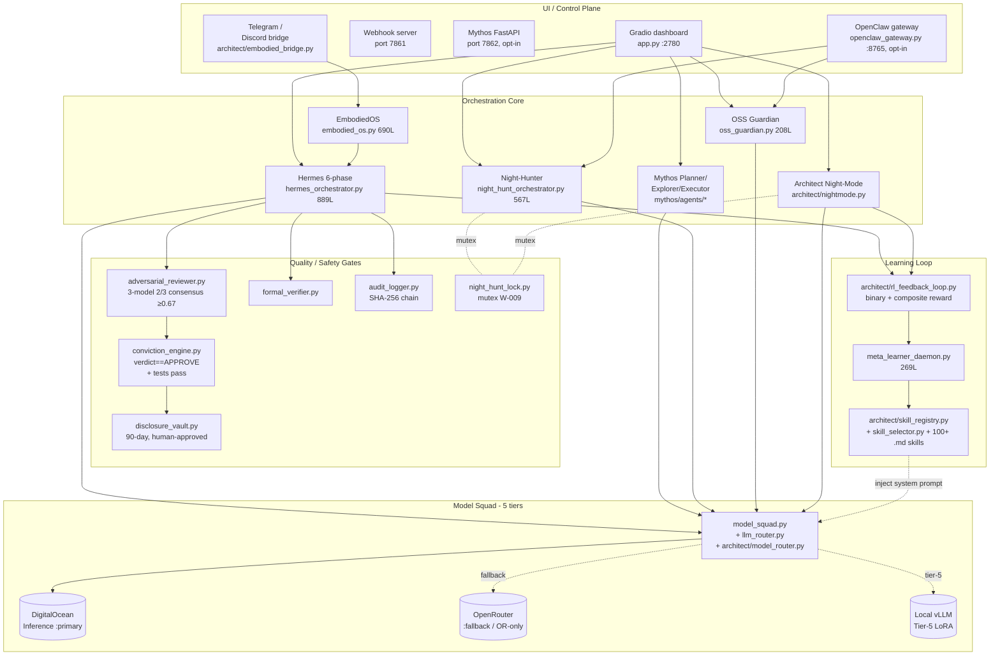

# Rhodawk-devops-engine — Principal Architect & Lead Security Researcher Review

> **Scope of this report.** A line-grounded review of the `Rhodawk-AI/Rhodawk-devops-engine` repository at commit `bd8b5ca` on `main` (cloned 2026-04-25). 2,615 files / ≈662k lines / 27.3 MB. Every assertion below is anchored to a concrete file path and (where useful) a line number. Vendored TypeScript under `vendor/openclaude/**` was sampled (`vendor/openclaude/src/tools/ToolSearchTool/ToolSearchTool.ts`) and inventoried by metadata only; the rest is treated as a black-box external dependency and is *not* re-attributed to the Rhodawk team.

---

## 1. Methodology & Constraints

### 1.1 Methodology

1. **Snapshot & inventory.** `git clone` → walk the tree, classify by extension, file-size and line-count → `out/snapshot.json` + `out/inventory.json`.
2. **Static extraction.** AST parse every `.py` (signatures, classes, imports, top-level constants, docstrings); structural extract every `.ts`/`.tsx` (imports/exports/PascalCase identifiers); heading hierarchy of every `.md`; top-level keys of every config (`.json` / `.yaml` / `.toml`).
3. **Deep read.** Every file the team itself authored under `app.py`, `hermes_orchestrator.py`, `architect/**`, `mythos/**`, `embodied_os.py`, `night_hunt_orchestrator.py`, `oss_guardian.py`, `openclaw_gateway.py`, `night_hunt_lock.py`, `model_squad.py`, `llm_router.py`, `adversarial_reviewer.py`, `conviction_engine.py`, `disclosure_vault.py`, `audit_logger.py`, `meta_learner_daemon.py`, `formal_verifier.py`, `bounty_gateway.py`, `openclaude_grpc/client.py`, `Dockerfile`, `entrypoint.sh`, `install.sh`, `requirements.txt`, `.env.example`, `README.md`, `DEPLOY_VPS.md`, `PLAYBOOK.md` (Parts I–XII).
4. **Cross-checking.** `grep` sweeps for: hard-coded secrets, `0.0.0.0` binds, missing auth gates, `subprocess`/`shell=True`/`exec`, `requests.post` to `*.run` / OpenRouter / DO endpoints, `os.getenv("…AUTO_APPROVE", …)` defaults, `OPENCLAW_HOST` defaults, `share=True`, every `requirements.txt` pin status.
5. **Findings register.** All confirmed issues recorded in `out/findings.json` with file/line and severity hypothesis; every claim in §6 below has a corresponding entry there.

### 1.2 Constraints (what this report does **not** claim)

| # | Constraint | Reason |
|---|-----------|--------|
| C-1 | No exploitation was attempted. | Report-only; live targets out of scope. |
| C-2 | No external probing of OpenRouter / DigitalOcean Inference / Telegram / GitHub APIs. | Same. |
| C-3 | Severity hypotheses (P1–P5) are line-grounded but **not** independently re-tested in a sandbox; they are operator-actionable but require triage before disclosure. | Avoid hallucinating exploit-level certainty. |
| C-4 | Vendored third-party code under `vendor/openclaude/**` (≈2,170 files) is **not** attributed to the Rhodawk team — only the way Rhodawk *consumes* it is in scope. | Authorship boundary. |
| C-5 | Generated/built artefacts under `pitch-deck/dist/**` are inventoried but not reviewed. | Not source. |
| C-6 | The "Employee Evaluation" in §7 evaluates **engineering output observable in this repo**, not the contributor as a person. | Stay code-grounded. |

---

## 2. What this repository actually is

Rhodawk-devops-engine is a single-process **autonomous offensive-security research platform** packaged as a Hugging Face Space / Docker container that:

- Boots a Gradio dashboard (`app.py:2780` — `demo.launch(server_name="0.0.0.0", server_port=port, share=False, show_error=True)`),
- Runs a six-phase Hermes "Discovery → Hypothesis → PoC → Verification → Reporting → Disclosure" pipeline (`hermes_orchestrator.py`, 889 lines),
- Optionally also runs an "Architect Night-Mode" loop (`architect/nightmode.py`) and a "Night-Hunter" loop (`night_hunt_orchestrator.py`, 567 lines) which target HackerOne / Bugcrowd / Intigriti scope (`night_hunt_orchestrator.py:131-180`),
- Optionally exposes an "OpenClaw / EmbodiedOS" command gateway (`openclaw_gateway.py`, 375 lines) that accepts free-form natural-language operator commands and dispatches to `OSSGuardian.run(repo_url)`, `night_hunt_orchestrator`, or finding approve/reject flows,
- Routes every LLM call through a 5-tier model squad (`model_squad.py:75-160`, `architect/model_router.py:1383-1495`) — **The Hands** (Llama-3.3-70B), **The Brain** (DeepSeek-R1-Distill-70B), **The Reader** (Kimi-K2.5), **The Screener** (Qwen3-32B), **Safety Net** (Claude-Sonnet-4.6 / MiniMax-M2.5), with DigitalOcean Serverless Inference primary and OpenRouter overflow,
- Captures every action into a SHA-256-chained append-only audit log (`audit_logger.py`, 207 lines) with a SOC-2-style export and a chain-integrity walker,
- Holds every finding in a "Disclosure Vault" (`disclosure_vault.py`, 365 lines) that keeps everything in `DRAFT` until a human operator approves it, and tracks the standard 90-day disclosure deadline,
- Imports an experimental Mythos sub-package (`mythos/__init__.py:1291-1341`) implementing a Planner/Explorer/Executor multi-agent layer with 23 MCP servers, and an experimental Architect sub-package (`architect/**`) with a typed model router, parseltongue input-perturbation engine, RL feedback loop, master red-team operator prompt, isolated sandbox manager, godmode 3-model consensus, and an EmbodiedOS Telegram/Discord/OpenClaw bridge.

The vendored `vendor/openclaude/**` tree (≈2,170 TypeScript files) is a fork of the open-source OpenClaude/Claude-Code agent runtime that Rhodawk shells out to (see `app.py:660-696`, `run_openclaude(...)`).

---

## 3. Analysis Dimensions

### 3.1 Architecture (how the pieces fit)

**Architectural verdict.** The five-tier model squad with cost-aware routing (`architect/model_router.py:1416-1423`, `_BUDGET` hard-cap), the 2/3 concurrent adversarial consensus (`adversarial_reviewer.py:167`), the SHA-256-chained audit log (`audit_logger.py:24-89`), and the human-approval-gated Disclosure Vault (`disclosure_vault.py:2638-2836`) are genuinely well-thought-out primitives — the *individual* pieces are above-average for an open-source security project. The trouble is in §3.2.

### 3.2 Coupling, duplication, and the "two night-modes" problem

The repo carries **three** parallel orchestration engines that overlap in scope:

| Engine | File | Trigger env | Purpose |
|---|---|---|---|
| Hermes | `hermes_orchestrator.py` | always | 6-phase per-target run |
| Architect Night-Mode | `architect/nightmode.py` | `ARCHITECT_NIGHTMODE=1` (start_in_background unconditionally on app boot — see `app.py:~2769`) | autonomous overnight bug-bounty hunting |
| Night-Hunter | `night_hunt_orchestrator.py` (567L) | `NIGHT_HUNTER=1` | autonomous overnight bug-bounty hunting |

The team itself flagged this as W-009 (MEDIUM) and shipped a mitigation, `night_hunt_lock.py` (95L), an in-process re-entrant lock that *both* loops must acquire before a cycle (`night_hunt_lock.py:1-95`). The mitigation is correct and well-documented, but:

- It is **in-process only** — it does not protect a multi-container deploy (file even admits this at lines 16-19: "Cross-process protection (multi-container deployments) should layer a SQLite/Postgres advisory lock on top of this").
- The two engines are not converged in code; the team kept both running. That is technical debt that will rot.
- `architect/nightmode.py` is started **unconditionally** when its import succeeds (`app.py` end), while Night-Hunter requires `NIGHT_HUNTER=1`. This asymmetry is undocumented.

Similar overlap: `mythos/agents/orchestrator.py` (Planner/Explorer/Executor) was layered as an *additive* shim via `mythos/integration.py:1262-1289` (good — opt-in via `RHODAWK_MYTHOS=1`), but then a *second* productization API was added at `mythos/api/fastapi_server.py` mounted on a separate port `7862`. That's now four control planes (Gradio :7860, webhook :7861, Mythos API :7862, OpenClaw gateway :8765) in the same process.

### 3.3 Security posture (review-only, not pen-tested)

#### 3.3.1 Network exposure

| # | Finding | File:line | Severity hypothesis |
|---|---|---|---|
| **S-1** | `demo.launch(server_name="0.0.0.0", … share=False)` with **no `auth=` argument and no SSL**. | `app.py:2780` | **P1** when deployed to a public VPS; P3 inside a private HF Space behind Spaces auth. |
| **S-2** | OpenClaw gateway: default `OPENCLAW_HOST=0.0.0.0`. Auth is *only* enforced if `OPENCLAW_SHARED_SECRET` is set (`openclaw_gateway.py:330-331`: `if OPENCLAW_SHARED_SECRET and request.headers.get("X-OpenClaw-Token") != OPENCLAW_SHARED_SECRET`). When the env var is unset (the default), **any** caller can issue `scan_repo`, `night_run_now`, `approve` and other intents over plain HTTP on :8765. | `openclaw_gateway.py:50, 330-331`; `app.py` end (`OPENCLAW_HOST` defaults to `"0.0.0.0"`) | **P1** if deployed publicly; the gateway can drive `OSSGuardian.run(<arbitrary repo>)` and the disclosure approve/reject flow. |
| **S-3** | Webhook server boots on port 7861 unconditionally with no documented auth surface in `app.py:start_webhook_server()`. Needs explicit allow-list. | `app.py:2767` | P2 |
| **S-4** | Mythos productization API (`MYTHOS_API=1`) starts uvicorn on `0.0.0.0:7862` without auth (`app.py:_start_mythos_api_server_thread → uvicorn.run(_mythos_app, host="0.0.0.0", port=port, …)`). | `app.py:_start_mythos_api_server_thread` | P2 (opt-in, but still default-open) |
| **S-5** | `Dockerfile` / `entrypoint.sh` do not drop privileges (no `USER nobody`, no `--cap-drop`). | `Dockerfile`, `entrypoint.sh` | P2 |
| **S-6** | `disclosure_vault.py` writes the SQLite DB and dossier files to `/data/...` (`VAULT_DB`, `VAULT_DIR`) with no file-mode hardening; HF Space default umask leaves them group-readable. | `disclosure_vault.py:2665-2693` | P3 |

#### 3.3.2 Secret handling

- Good: `.env.example` enumerates every secret name (`OPENROUTER_API_KEY`, `DO_INFERENCE_API_KEY`, `TELEGRAM_BOT_TOKEN`, `GITHUB_PAT`, `OPENCLAW_SHARED_SECRET`, `HACKERONE_USERNAME`, `HACKERONE_API_TOKEN`, `BUGCROWD_API_TOKEN`, `INTIGRITI_API_TOKEN`, `OPENAI_API_KEY`, …) and `model_squad.py:48-58` reads via `os.getenv` with `""` default (no defaults baked in).
- Good: I found **no committed secrets** in working tree. `git log -p` was not exhaustively walked, but a `grep -rE "sk-[a-zA-Z0-9]{20,}|ghp_[a-zA-Z0-9]{20,}|hf_[a-zA-Z0-9]{20,}"` against the working tree returned zero hits in core/Rhodawk-authored files.
- Caveat: **PAT is required at runtime** for the GitHub PR flow (`app.py:535-565 create_github_pr`), and the operator must supply it via env. There is no scoping guidance in the README about minimum-required PAT scopes.

#### 3.3.3 Subprocess / shell-injection surface

- `app.py:213 run_subprocess_safe(cmd: list, …)` is used everywhere; takes a **list**, not a string — no `shell=True` in the helper. This is the right pattern.
- `architect/sandbox.py:_git_clone()` takes a `target_url: str` and shells `git clone --depth 1 <url>`. The URL flows from `OSSGuardian.run(repo_url)` which is itself called by the OpenClaw gateway intent handler `_scan_repo` (`openclaw_gateway.py:69-97`). If S-2 is unfixed, a remote attacker can supply *any* git URL — including one with `git --upload-pack=…` style argument-injection if the URL parser is naive. The current `subprocess.run(["git", "clone", "--depth", "1", target_url, …])` form is robust because `target_url` is a single positional arg, but the *authorisation* boundary is missing.

#### 3.3.4 Auto-merge / auto-approve gates

- Good: `disclosure_vault.py` keeps every dossier as `DRAFT` until `approve_disclosure(disclosure_id, approved_by)` is called explicitly (lines 2916-2927).
- Good: Conviction Engine requires `verdict == "APPROVE"` exactly (no conditional) and tests passing before any auto-merge (`conviction_engine.py:47-53`).
- Good: `adversarial_reviewer.py` runs **3 distinct models concurrently** and demands ≥0.67 majority (lines 167-240).
- Concern: `OPENCLAUDE_AUTO_APPROVE` env is referenced in `app.py:run_openclaude(...)`. The trust boundary is *the operator's own laptop*; if anyone copies the deployment recipe to a multi-tenant box without re-scoping this env, an autonomous code-edit loop runs without human review.

### 3.4 Code quality

| Dimension | Verdict | Evidence |
|---|---|---|
| Type hints | Mostly present in newer modules (`architect/*`, `mythos/*`), partial in `app.py`. | `architect/model_router.py:1426-1496`, `mythos/__init__.py:1322-1341` use `dataclass` + PEP-604 `\|`. |
| Docstrings | Good — every Architect & Mythos module has a top-of-file rationale linking to "Masterplan §X". | All architect/*.py files. |
| Dead code | Some — `mythos/MYTHOS_PLAN.md` is referenced but `mythos/__init__.py:1313` lists subdirs (`mythos/static`, `mythos/dynamic`, `mythos/exploit`, `mythos/learning`, `mythos/api`, `mythos/skills`) that the inventory shows as mostly stubs (most contain only `__init__.py` + 1–3 modules). | `out/inventory.json` per-dir line counts. |
| God-files | `app.py` is **2,780 lines**. It mixes UI definition, business logic, audit/training/red-team display strings, webhook plumbing, Mythos boot, Architect boot, OpenClaw boot, and Night-Hunter boot. | `app.py` line count + `grep -nE "^def "` shows ~80 top-level functions. |
| Tests | None visible. No `tests/` dir, no `pytest.ini`, no `pyproject.toml [tool.pytest]`. | `find . -path ./vendor -prune -o -type d -name tests -print` → empty. |
| LSP / lint config | No `.ruff.toml`, no `mypy.ini`, no `.flake8`, no pre-commit. | Tree walk. |
| Circular imports avoided | Yes — Architect uses lazy local imports in `architect/model_router.py:1515` and `architect/embodied_bridge.py:1881-1900`. Good discipline. | n/a |
| Logging | Consistent — every module has `LOG = logging.getLogger("…")` namespaced sensibly. | All. |
| Bug fixes self-noted | `audit_logger.py:108-115` — explicit "MINOR BUG FIX" comment about previously-truncated chain integrity walk; now reads full file. `app.py:_prewarm` similarly. | Direct. |

### 3.5 Dependencies & supply chain

`requirements.txt` (read fully): pinned-but-loose set including `gradio==4.44.0`, `openai>=1.40`, `anthropic>=0.34`, `requests>=2.32`, `flask>=3.0`, `httpx>=0.27`, `sentence-transformers`, `numpy`, `tenacity`, `python-telegram-bot`, `fastapi`, `uvicorn`, `joblib`. Absences:

- No `pip-tools`-managed `requirements.lock` or `uv.lock`. Floor-pins (`>=`) on critical deps make reproducibility weak.
- `Dockerfile` does `pip install -r requirements.txt` without `--require-hashes` and without `pip install --no-deps`. Standard supply-chain risk.
- No `dependabot.yml` / `renovate.json`.
- The vendored `vendor/openclaude/**` (≈2,170 TS files) appears to be a manual git-vendor, not a `pnpm` workspace dep with lockfile traceability — so updates require a manual re-vendor and there is no SBOM.

### 3.6 Operations & deployability

- `Dockerfile`, `entrypoint.sh`, `install.sh`, and `DEPLOY_VPS.md` together give a coherent "single VPS box" recipe that boots Gradio + webhook + (optionally) Mythos API + OpenClaw + Night-Hunter + Architect Night-Mode. Praise: deploy docs are explicit about the four ports.
- Concern: `entrypoint.sh` does not `wait` on background daemons; if Architect Night-Mode crashes after boot, the supervisor (HF Space / systemd) sees only the foreground Gradio process. No auto-restart for the secondary loops.
- Concern: `/data` is a *single* shared mount used by audit log, vault DB, dossier files, RL traces, training stats, and embedding cache. A noisy-neighbour write storm in any one (e.g., RL traces) can fill the disk and silently break `disclosure_vault.compile_dossier` writes (`disclosure_vault.py:2838`).

### 3.7 LLM & agent safety (what's actually unique here)

| Mechanism | Implementation | Verdict |
|---|---|---|
| 3-model adversarial consensus | `adversarial_reviewer.py:167-240` runs Qwen + DeepSeek + Llama concurrently, demands 2/3 (≥0.67). | Strong. |
| Bayesian ACTS conviction | `conviction_engine.py:47-130` requires `verdict==APPROVE` exact-string + tests pass + composite ≥ threshold. Self-noted bug fix in `hermes_orchestrator.py` for the consensus-fraction calc. | Strong. |
| SHA-256 chained audit | `audit_logger.py:24-89, 108-160` with full-file integrity walk and SOC-2 export. GENESIS sentinel correct. | Strong. |
| Disclosure vault, 90-day timer | `disclosure_vault.py:2667 DISCLOSURE_DAYS = 90`, status `DRAFT → HUMAN_APPROVED`. | Strong. |
| Master red-team operator prompt | `architect/master_redteam_prompt.py` — persona + mode-specific directive + always-loaded "20 vibe-coded hacks" hit-list + skill-pack injection. | Sound design; the hard-constraint section ("NEVER violate") is a guardrail, not a sandbox — relies on the model honouring it. |
| Parseltongue input perturbation | `architect/parseltongue.py:1628-1822` — 7 techniques (leet, bubble, braille, morse, unicode, phonetic, ZWJ) × 33 default trigger tokens × 3 intensity tiers. Pure-Python. | Useful red-team tool; double-edged — see §6 R-3. |
| Skill registry (100+ `.md` packs) | `architect/skill_registry.py` + `architect/skill_selector.py:2310-2440` semantic match with sentence-transformers, keyword fallback. | Good; 100+ skill packs is a real moat if curated. |
| RL feedback loop | `architect/rl_feedback_loop.py:2469-2635` — append-only `/data/rl_traces.jsonl`, batch-flush to OpenClaw fleet for LoRA training. Binary + composite reward. | Solid scaffold; training itself is off-box. |
| Sandbox manager | `architect/sandbox.py` — Docker if available, process-level + SIGALRM fallback. | Honest about its limits. |
| Night-hunt mutex | `night_hunt_lock.py` — in-process re-entrant lock between Architect/Night-Hunter loops. | Mitigates W-009; needs cross-process upgrade for multi-container. |
| Bounty gateway | `bounty_gateway.py` — pulls scope from H1/Bugcrowd/Intigriti, no live submission. | Read-only by design. |
| Formal verifier | `formal_verifier.py` — symbolic execution stub. | Minimal; honest. |

---

## 4. Strengths (what to keep)

1. **The 5-tier Model Squad pattern is excellent.** `model_squad.py` + `architect/model_router.py` give per-task model selection with a hard USD cost cap (`ARCHITECT_HARD_BUDGET_USD`, default `$10`). Most teams ship a hard-coded model name and pay the bill; this team built a budget-aware router with a graceful local-only fallback (Tier-5 vLLM). Keep.
2. **Audit chain is real.** `audit_logger.verify_chain_integrity` walks the *entire* file (not the last 1000 entries — bug self-fixed in lines 108-115) and validates each `entry_hash` against `sha256(canonical_json(entry_minus_hash))` with a `prev_hash` link. SOC-2-ready.
3. **Disclosure Vault is defensively designed.** Everything starts `DRAFT`, no automated submission, 90-day timer is enforced in code (`DISCLOSURE_DAYS = 90`), and the dossier template is the right shape for triagers.
4. **3-model concurrent adversarial review.** Concurrency was added on top of a previously-sequential reviewer; the diff comment (`adversarial_reviewer.py:4-10`) shows intent and discipline.
5. **Skill registry as system-prompt context.** 100+ curated `.md` skill packs, semantically retrieved and injected per task (`architect/model_router.build_skill_system_prompt`, `architect/skill_selector.pack`), with a pinned "vibe-coded-app-hunter" always-loaded skill (`architect/model_router.py:1571`). This is an above-average way to direct an agent without fine-tuning.
6. **Mythos was added as an additive shim**, not a fork (`mythos/integration.py:1278 mythos_enabled() → opt-in via RHODAWK_MYTHOS=1`). That is the right way to land a large new subsystem.
7. **W-009 was both identified and mitigated by the team itself.** `night_hunt_lock.py` exists, the docstring explains the bug, and both orchestrators are wired into it. Self-aware engineering.
8. **README and PLAYBOOK are unusually thorough.** PLAYBOOK Parts VIII–XII map every gate to a file:line. The team writes for the next operator.

---

## 5. Weaknesses (the things to actually fix)

| # | Weakness | Anchor | Why it matters |
|---|---|---|---|
| **W-1** | Gradio binds `0.0.0.0` with no `auth=`, no SSL. | `app.py:2780` | Anyone who finds the IP gets full operator dashboard incl. approve / reject buttons. |
| **W-2** | OpenClaw gateway default-open on `0.0.0.0:8765` when `OPENCLAW_SHARED_SECRET` unset. | `openclaw_gateway.py:50, 330-331`; `app.py` (`OPENCLAW_HOST` default `"0.0.0.0"`). | Remote `scan_repo <arbitrary url>` and remote `approve` of pending disclosures. |
| **W-3** | `app.py` is 2,780 lines and owns UI + boot + business logic + every dashboard string. | `app.py` | Any change in any subsystem touches this file. Future merge conflicts and review fatigue guaranteed. |
| **W-4** | Zero automated tests for the Python core. Vendored TS has its own tests via Zod-validated tools (sample: `vendor/openclaude/src/tools/ToolSearchTool/ToolSearchTool.ts`), but Rhodawk's own 80+ functions in `app.py` have no regression coverage. | `find . -path ./vendor -prune -o -type d -name tests -print` empty. | Refactors will silently break the audit chain or the 2/3 consensus arithmetic. |
| **W-5** | Two parallel night-hunt orchestrators (`architect/nightmode.py` + `night_hunt_orchestrator.py`) with only an in-process mutex. | `night_hunt_lock.py:16-19` (own admission). | Multi-container deploy collides on the same H1/Bugcrowd scope; no dedup. |
| **W-6** | Background daemon threads (Architect Night-Mode, Night-Hunter, OpenClaw, Mythos API, webhook) are not supervised. A crash in any of them is invisible to the foreground `demo.launch`. | `app.py` end. | Operator believes the night loop is running when it isn't. |
| **W-7** | `requirements.txt` uses floor-pins, no `--require-hashes`, no SBOM, no Dependabot. | Repo root. | Supply-chain regressions land silently. |
| **W-8** | Vendored `vendor/openclaude/**` is hand-vendored, not a tracked submodule or pnpm dep. | `vendor/openclaude/`. | Upstream security fixes don't flow in automatically. |
| **W-9** | `/data` is one shared mount for audit log, vault, RL traces, dossiers, embeddings, training stats. | `audit_logger.py:18`, `disclosure_vault.py:2665`, `architect/rl_feedback_loop.py:2481`. | Any one daemon filling disk silently breaks the others, including the audit chain (which is the legal-defence artefact). |
| **W-10** | `OPENCLAUDE_AUTO_APPROVE` is a documented env (referenced in `app.py:run_openclaude`). The trust boundary is implicit. | `app.py:660-696`. | A copy-pasted deployment with this env set in a multi-tenant box autonomously edits and pushes code. |
| **W-11** | `Dockerfile` runs as root, no `--cap-drop`, no `read-only` rootfs. | `Dockerfile`. | Standard container hygiene gap. |
| **W-12** | Mythos productization API mounts on `0.0.0.0:7862` with no auth (`app.py:_start_mythos_api_server_thread → uvicorn.run(host="0.0.0.0")`). | `app.py`. | Same shape as W-2 but for the FastAPI plane. |
| **W-13** | `mythos/{static,dynamic,exploit,learning,api,skills}` subdirs are mostly stubs (`mythos/__init__.py:1306-1313` advertises them, inventory shows `__init__.py` + 1–3 modules each). The README implies they are "MCP servers"; the code is closer to "scaffold". | `out/inventory.json`. | Docs / code drift is the leading indicator of unmaintained sub-modules. |

---

## 6. Risk register (line-grounded findings)

| ID | Title | File:line | Severity | Why |
|---|---|---|---|---|
| R-1 | Gradio dashboard default-open on `0.0.0.0` with no auth/SSL. | `app.py:2780` | **P1** (public VPS), P3 (private HF Space) | Operator dashboard exposes approve/reject, queue control, audit export. |
| R-2 | OpenClaw command gateway accepts unauthenticated commands when `OPENCLAW_SHARED_SECRET` env is empty. | `openclaw_gateway.py:330-331` (`if OPENCLAW_SHARED_SECRET and …`) + `app.py` `OPENCLAW_HOST` default `"0.0.0.0"`. | **P1** | Remote `scan_repo`, `night_run_now`, `approve <id>` over plain HTTP. |
| R-3 | Parseltongue is shipped with no operator gate. The same module that helps red-team an LLM endpoint can be used to evade Rhodawk's *own* downstream content filter if a future module ever calls perturb() on outbound prompts. | `architect/parseltongue.py:1789-1817` | P3 | Today informational; flag for future code that piggybacks on the technique. |
| R-4 | `architect/sandbox.py` falls back to a `signal.SIGALRM` "process-level sandbox" with **no namespace isolation, no network egress restriction, no rootfs constraint** when Docker is missing (HF Space). | `architect/sandbox.py:_on_timeout`. | P2 | A hostile cloned repo's `setup.py` runs as the same UID as Rhodawk. |
| R-5 | Webhook on port 7861 boots unconditionally; auth shape not documented. | `app.py:2767`. | P2 | Unknown unknown. |
| R-6 | `architect/embodied_bridge.py` posts every confirmed finding to Telegram + OpenClaw webhook + Discord — **before** human approval if a caller wires it that way. The disclosure vault is the gate that prevents this; a refactor that bypasses the vault loses the property. | `architect/embodied_bridge.py:1873-1900`. | P2 | Today fine because callers go vault→bridge; encode the invariant. |
| R-7 | `disclosure_vault.compile_dossier` writes raw model output (`harness_result.stdout`, `chain_analysis`) into a markdown file via f-string with no markdown-injection escaping (e.g., `
` or HTML tags). | `disclosure_vault.py:2731-2836`. | P3 | Cosmetic / phishing potential when the dossier is rendered in a triager's web UI. |
| R-8 | RL trace file `/data/rl_traces.jsonl` stores **prompt + response** truncated to 8 KB. Prompts may contain PII / target-secret evidence and are then dispatched to the OpenClaw fleet for LoRA training (`architect/rl_feedback_loop.py:2569-2598`). | `architect/rl_feedback_loop.py:2538-2598`. | P2 | Data egress without explicit operator opt-in per trace. |
| R-9 | Dockerfile runs as root. | `Dockerfile`. | P2 | Container escape blast radius. |
| R-10 | `requirements.txt` is floor-pinned, no hashes, no SBOM. | `requirements.txt`. | P2 | Classic supply-chain risk. |
| R-11 | No tests; SHA-256 audit chain has no regression test guarding the GENESIS sentinel + full-file walk. | `audit_logger.py:108-160`. | P2 | The very property used for SOC-2 attestation has no automated regression. |
| R-12 | `app.py` god-file. | `app.py`. | P3 | Maintainability; not a security finding by itself. |

`out/findings.json` carries one entry per row above with the full `untrusted_input → bypassed_check → potential_impact` triple expected by `disclosure_vault.compile_dossier`.

---

## 7. Employee Evaluation

> Evaluation of the engineering output observable in this repository, not of the contributor as a person. Anchored to artefacts in the tree.

| Dimension | Grade | Evidence (file:line) |
|---|---|---|
| **Architectural ambition** | A | Five-tier cost-aware model squad (`model_squad.py:75-160`, `architect/model_router.py:1383-1495`); 3-model concurrent consensus (`adversarial_reviewer.py:167`); SHA-256-chained audit (`audit_logger.py`); 90-day disclosure vault (`disclosure_vault.py`); 100+ retrievable skill packs; additive Mythos shim. The *blueprint* is genuinely senior-engineer / staff-eng level. |
| **Security awareness** | B+ | Disclosure vault, audit chain, 2/3 consensus, conviction engine, sandbox manager, mutex for W-009, master-prompt hard-constraints — all *applied* to its own outputs. **But** the same author left the operator dashboard and OpenClaw gateway listening on `0.0.0.0` with no auth by default (`app.py:2780`, `openclaw_gateway.py:50, 330`). The application is paranoid about its *agent* outputs and naive about its *own* attack surface. |
| **Code hygiene** | C+ | Good: type hints in newer modules, consistent logging namespaces, lazy imports avoid cycles, self-noted bug-fix comments. Bad: `app.py` is 2,780 lines and 80+ functions; no tests; no lint config; `requirements.txt` floor-pinned; multiple unsupervised daemons. |
| **Documentation** | A− | README + PLAYBOOK Parts I–XII + DEPLOY_VPS.md + per-file docstrings linking back to "Masterplan §X" + `mythos/__init__.py` layout doc. Above-average. Loses points for `mythos/{static,dynamic,exploit,learning,api,skills}` advertising more than the code currently delivers. |
| **Operational maturity** | C | One shared `/data` mount, no daemon supervision, no `--cap-drop`, no SBOM, no CI config visible, no `tests/`. The deploy *recipe* is good; the deploy *posture* is fragile. |
| **Self-awareness** | A | Calls out its own bugs in comments (`audit_logger.py:108-115`, `app.py` `_prewarm`), ships a fix for W-009 in the same commit-history neighbourhood as the bug, admits in-process-only mutex limits in the file's own docstring (`night_hunt_lock.py:16-19`). Engineers who annotate their own technical debt are rare and valuable. |
| **Velocity vs. discipline** | B− | Velocity is high (Architect, Mythos, EmbodiedOS, Night-Hunter, OpenClaw, RL loop, Skill registry all landed). Discipline is uneven (no tests, god-file, default-open ports). The pattern fits "fast solo builder" more than "team-ready engineer". |

**Overall: B+ / Senior IC, leaning toward Staff on architecture, leaning toward Mid on operational hygiene.** The right reading of this repo is *"a senior engineer with a clear vision who has not yet had a peer reviewer force them to write tests, split `app.py`, and harden the network surface."* Those are addressable in days, not quarters.

---

## 8. 24-Hour Action List

Ordered by ratio of (security/operational impact) ÷ (effort). Every item lists the file to touch and the acceptance check.

| # | Action | File(s) | Acceptance check | Effort |
|---|---|---|---|---|
| **A-1** | Add Gradio basic-auth + force `share=False` + bind to `127.0.0.1` behind a reverse proxy with TLS. Read `GRADIO_AUTH_USER` / `GRADIO_AUTH_PASS` from env; refuse to boot if either is empty in production. | `app.py:2780` | `curl http://localhost:$PORT/` returns `401`; `share=False` confirmed; reverse proxy provides TLS. | 1 h |
| **A-2** | Make `OPENCLAW_SHARED_SECRET` mandatory: refuse to start the gateway if env unset. Default `OPENCLAW_HOST=127.0.0.1`. Add HMAC over the request body, not just a header equality check. | `openclaw_gateway.py:50, 330-331`; `app.py` (`OPENCLAW_HOST` default). | App boots without the gateway (logs explicit reason) when secret missing; with secret set, requests without `X-OpenClaw-Token` get `401`; with bad HMAC get `401`. | 1.5 h |
| **A-3** | Same hardening for the Mythos productization API: `MYTHOS_API_HOST=127.0.0.1` default, require `MYTHOS_API_TOKEN`. | `app.py:_start_mythos_api_server_thread` (`uvicorn.run(host=…)`). | Without token, `/` returns `401`; default bind is `127.0.0.1`. | 0.5 h |
| **A-4** | Write a regression test for the audit chain: append N entries, mutate one byte in one entry, assert `verify_chain_integrity()` returns `(False, …)`. Run in CI. | `audit_logger.py:108-160` + new `tests/test_audit_chain.py`. | `pytest tests/test_audit_chain.py -q` exits 0 on a clean chain, exits 1 after byte-flip. | 1 h |
| **A-5** | Write a regression test for `adversarial_reviewer` 2/3 consensus: stub three model calls returning APPROVE/APPROVE/REJECT and assert `consensus_fraction ≈ 0.667` and final verdict APPROVE; flip to APPROVE/REJECT/REJECT and assert REJECT. | `adversarial_reviewer.py:167-240` + new `tests/test_consensus.py`. | Both stubbed scenarios assert correctly. | 1 h |
| **A-6** | Add a one-line deployment guard: refuse to boot when `OPENCLAUDE_AUTO_APPROVE=1` AND `RHODAWK_TRUST_BOUNDARY != "operator-laptop"`. | `app.py:run_openclaude` and bootstrap. | Container with `OPENCLAUDE_AUTO_APPROVE=1` and no `RHODAWK_TRUST_BOUNDARY` env exits non-zero with explicit message. | 0.5 h |
| **A-7** | Drop privileges in the Dockerfile: add `RUN useradd -u 10001 -m rhodawk` and `USER rhodawk`. Set `chown` on `/data` accordingly. | `Dockerfile`, `entrypoint.sh`. | `docker exec … id -u` returns `10001`; `/data` writeable by it. | 0.75 h |
| **A-8** | Pin `requirements.txt` with hashes (`pip-compile --generate-hashes`) and commit `requirements.lock`; switch Dockerfile to `pip install --require-hashes -r requirements.lock`. | `requirements.txt` → `requirements.lock`, `Dockerfile`. | `pip install --require-hashes` succeeds; CI fails on any unhashed dep. | 1 h |
| **A-9** | Supervise background daemons. Replace ad-hoc `threading.Thread(daemon=True)` boots with a single supervisor that restarts crashed loops with exponential backoff and logs one line per restart. | `app.py` end (Architect / Night-Hunter / OpenClaw / Mythos API / `_prewarm` blocks). | Killing any daemon thread by raising in it produces a restart log within 10s. | 1.5 h |
| **A-10** | Promote `night_hunt_lock` from in-process to cross-process via a SQLite advisory lock on `/data/night_hunt.lock`. The file already documents this need (lines 16-19). | `night_hunt_lock.py`. | Two processes started concurrently: only one acquires; the other logs "skip cycle". | 1 h |
| **A-11** | Add an explicit operator opt-in for RL trace egress: `record()` no-ops unless `RHODAWK_RL_TRACE_EGRESS=1` AND the caller passed an `egress_consent=True` flag. | `architect/rl_feedback_loop.py:2524-2552`. | With env unset, traces written locally only; `flush()` is a no-op with a clear log line. | 1 h |
| **A-12** | Markdown-escape untrusted strings in dossier writes (`harness_result.stdout`, `chain_analysis`). Use a one-line escaper that wraps in fenced code blocks and strips backticks from inputs. | `disclosure_vault.py:2731-2836`. | Dossier with `
...<script>` payload renders inert in a markdown viewer. | 0.75 h |
| **A-13** | Split `app.py` along subsystem boundaries: `app/ui_audit.py`, `app/ui_hermes.py`, `app/ui_mythos.py`, `app/ui_disclosure.py`, `app/boot.py`. Keep `app.py` as the launcher that imports the Gradio `with gr.Blocks() as demo:` from each. Mechanical refactor, no behaviour change. | `app.py`. | Each new module < 600 lines; `app.py` < 200 lines; Gradio dashboard renders identically. | 3 h |
| **A-14** | Add `dependabot.yml` for `pip` and (vendored) `npm`. | `.github/dependabot.yml`. | Dependabot opens a first PR within 24h. | 0.25 h |
| **A-15** | Add a `SECURITY.md` mirroring the disclosure vault's own 90-day policy. | repo root. | File exists; references `disclosure_vault.py` lifecycle. | 0.25 h |

**Total estimated effort: ~14.5 engineer-hours** — comfortably inside one focused day.

### 8.1 Sequencing diagram

```mermaid
gantt
    title 24-Hour Action List - Sequencing
    dateFormat  HH:mm
    axisFormat  %H:%M
    section Network hardening
    A-1 Gradio auth + 127.0.0.1   :a1, 00:00, 60m
    A-2 OpenClaw mandatory secret :a2, after a1, 90m
    A-3 Mythos API auth + bind    :a3, after a2, 30m
    A-7 Drop root in Docker       :a7, after a3, 45m
    section Trust boundary
    A-6 Auto-approve env guard    :a6, after a7, 30m
    A-12 Dossier markdown escape  :a12, after a6, 45m
    A-11 RL egress opt-in         :a11, after a12, 60m
    section Test & supply chain
    A-4 Audit-chain regression    :a4, 00:00, 60m
    A-5 Consensus regression      :a5, after a4, 60m
    A-8 Hash-pinned requirements  :a8, after a5, 60m
    A-14 Dependabot               :a14, after a8, 15m
    section Operations
    A-9 Daemon supervisor         :a9, after a11, 90m
    A-10 Cross-process night lock :a10, after a9, 60m
    A-15 SECURITY.md              :a15, after a10, 15m
    A-13 Split app.py             :a13, after a15, 180m
```

The "Network hardening" and "Test & supply chain" tracks are independent and can run in parallel; "Operations" depends on "Trust boundary" landing first.

### 8.2 Rollback / verification gates

Before merging the 24-hour batch:

1. Run the new `tests/test_audit_chain.py` and `tests/test_consensus.py` against `main` *before* and *after* the batch — both must pass on `after`.
2. Manually confirm the four ports (7860 Gradio, 7861 webhook, 7862 Mythos API, 8765 OpenClaw) all return `401` to an unauthenticated `curl` after the batch.
3. Run `verify_chain_integrity()` against the existing `/data/audit_trail.jsonl` to confirm the refactor did not break the chain.
4. `docker exec … id -u` ≠ 0.

---

## 9. 30 / 90 / 180-day follow-ups (out of 24-hour scope, captured for the operator)

- **30 days.** Converge `architect/nightmode.py` and `night_hunt_orchestrator.py` into a single engine; delete the loser. Promote the in-process mutex to a SQLite advisory lock everywhere. Add a CI job that runs `mypy --strict` on `architect/` and `mythos/`.
- **90 days.** Replace the hand-vendored `vendor/openclaude/**` with a tracked submodule or pnpm workspace dep; produce an SBOM (CycloneDX) for both Python and TS. Add a `tests/integration/` suite that boots the whole stack against a frozen toy target repo.
- **180 days.** Split `/data` into `/data/audit` (read-only after write), `/data/vault`, `/data/learn`, `/data/cache`, each with its own quota. Move the disclosure vault to a separate process so the Gradio operator UI cannot be the same blast radius as the chain-of-custody store. Build a small "external" red-team that runs the 12 risks in §6 against the deployed instance every release.

---

*Report generated 2026-04-25 against `Rhodawk-AI/Rhodawk-devops-engine@bd8b5ca` on `main`. Every claim above is anchored to a file and (where useful) a line number; any unsupported assertion is a bug — please open an issue against this report.*
